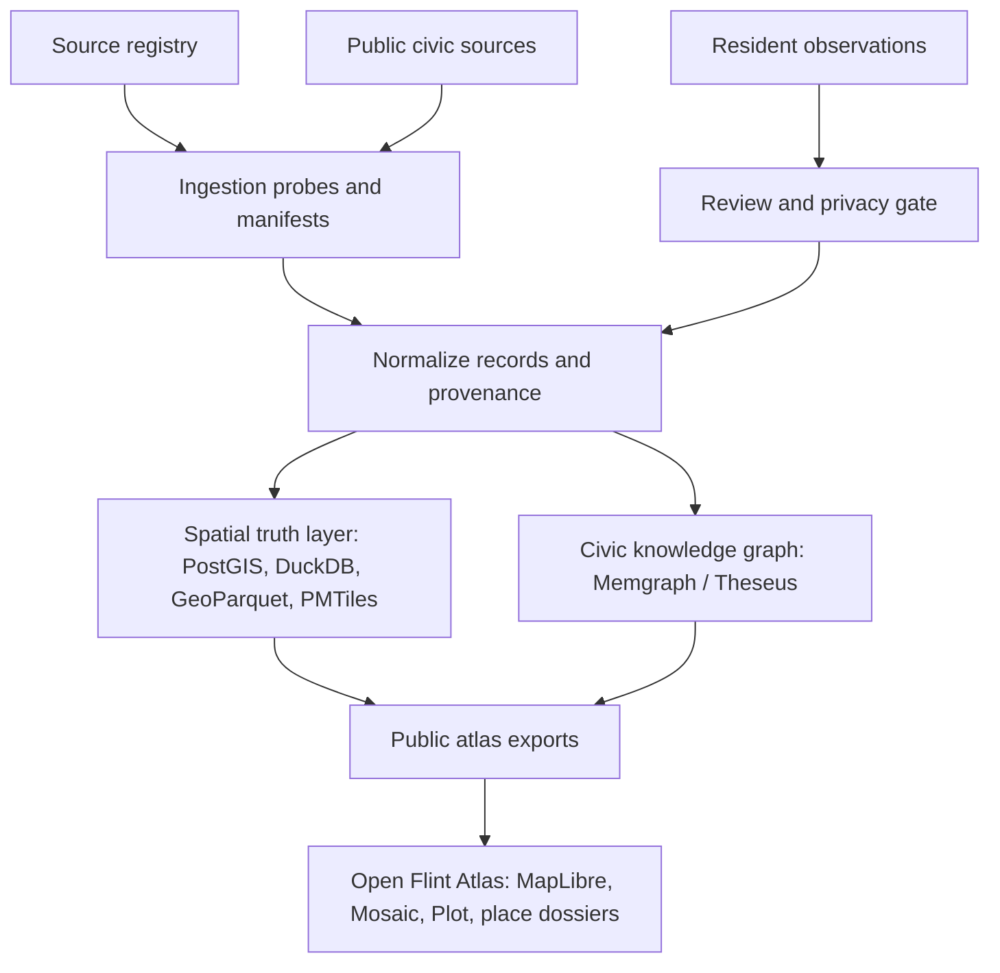

# Orchestrate Plan: Open Flint Atlas

**Slug:** `open-flint-atlas`
**Mode:** `/orchestrate mode=plan`
**Source notes:** `Theseus/Civic Flint 1.md`, `Theseus/Civic Flint 2.md`
**First executable artifacts:** `docs/plans/open-flint-atlas/source-registry.json`, `docs/plans/open-flint-atlas/fixtures/read-model/`
**Validators:** `scripts/validate_open_flint_source_registry.py`, `scripts/validate_open_flint_source_probes.py`, `scripts/validate_open_flint_read_model.py`, `scripts/validate_open_flint_provenance_graph.py`, `scripts/validate_open_flint_contribution_workflow.py`, `scripts/validate_open_flint_prototype.py`, `scripts/validate_open_flint_public_package.py`

## Executive Summary

- **Goal:** Turn the Civic Flint idea into public-interest infrastructure: a free, source-grounded, mobile-first civic atlas for Flint that makes place data, source provenance, uncertainty, and community correction legible.
- **Intent:** Build an open civic instrument, not a closed product. The public value is the atlas; future consulting value comes from reusable methods, documentation, and trust.
- **Summary of work:** Start with a source registry and trust/privacy contract, then ship a narrow v0.1 neighborhood explorer: wards, census tracts, zoning, parks, health resources, crash trends, selected ACS indicators, source freshness, and place dossiers.

## Current Condition

- The plan now has a seed source registry, source probes, a v0.1 data dictionary, a first public read-model fixture, a fixture-only provenance graph contract, a static mobile-first dossier prototype, a routed Next.js atlas shell, MapLibre/deck.gl desktop map, Leaflet mobile map, Mosaic/vgplot timeline, cosmos.gl provenance panel, staff-gated capture/admin lane, contribution review/privacy workflow, and a standalone public package boundary. No public submission form, production PostGIS table, or canonical Memgraph write path exists yet.
- The current public domain target is `mappingourcity.org`. `flintmapped.org` remains a transition alias until the new domain is added to Vercel, pointed at Vercel DNS, issued TLS, smoke-tested, and optionally made the primary redirect target.
- Index-API already has useful adjacent capabilities: native web research, WebDoc ingestion, Memgraph/MAGE graph runtime, THG hot graph surfaces, spatial/spacetime/causal modules, Context Theorem SDK/harness surfaces, and Next/Observable/D3 reference material.
- Prior memory says TimesFM is not currently shipped as a real production adapter in this codebase. Treat TimesFM and spacetime GNN work as later experiments, not as v0.1 infrastructure.
- The repo is currently dirty and ahead of `origin/main`; this plan keeps the first slice narrow and does not touch unrelated UI or generated Playwright files.

## Follow-On Planning Tracks

- Atlas Core One now carries the next contract-heavy planning slice for this public-good project: `docs/plans/open-flint-atlas/atlas-core-one-plan.md`.
- The Atlas Core One handoff that expands source manifests and doc cross-links without adding live routes or ingestion jobs lives at `docs/plans/open-flint-atlas/atlas-core-one-5-4-handoff.md`.
- The Spatial Event Index contract that Atlas Core One uses for Lost Flint, intervention ledger, and street-safety event grammar lives at `docs/plans/open-flint-atlas/spatial-event-index-contract.md`.

## Goal

| Axis | Target |
|---|---|
| User-visible outcome | A public Open Flint Atlas v0.1 where residents, organizers, journalists, students, and public servants can search or tap a place, see key facts, source freshness, confidence reasons, and nearby/context metrics. |
| System behavior | Source registry drives ingestion eligibility, provenance cards, privacy gates, and trust scoring. Spatial records live in PostGIS/DuckDB/GeoParquet; source/claim/conflict/review relationships live in Memgraph/Theseus graph surfaces. |
| Data/model changes | Create a first-class source registry, data dictionary, trust model, privacy policy, ingestion manifests, spatial exports, provenance graph contract, and contribution/review state machine. |
| Operational impact | v0.1 should be cheap to host and inspect: static PMTiles/GeoParquet/DuckDB exports first, heavier PostGIS/Memgraph services when ingestion and review paths justify them. |
| What must not regress | Do not claim government authority. Do not expose contributor identities or household-level implications by default. Do not present model predictions as facts. Do not use graphs as a replacement for spatial queries that PostGIS handles better. |

## Public Principles

1. Public benefit over monetization.
2. Open by default, private where harm is possible.
3. Sources are visible.
4. Uncertainty is visible.
5. Community reports are observations, not automatic facts.
6. Mobile access is core access.
7. The atlas does not impersonate government.
8. Model predictions are labeled as predictions.
9. Data changes are logged.
10. Reuse by other communities is encouraged.

## Architecture

### Storage Split

| Layer | Owns | First use |
|---|---|---|
| PostGIS / DuckDB spatial | Geometry, containment, buffers, intersections, spatial joins, tract/ward/corridor rollups | v0.1 spatial truth |
| Memgraph / Theseus graph | Sources, datasets, records, claims, conflicts, observations, review decisions, provenance trails | v0.1 trust and source accountability |
| GeoParquet / PMTiles | Cheap public read models for map and chart surfaces | v0.1 public deployment |
| TimesFM / ST-GNN | Forecasting and graph temporal experiments, clearly labeled as predictions | Phase 3 only |

## UI Visual Milestone

| Gate | Requirement | Evidence/validator | Status |
|---|---|---|---|
| Runtime complete | Registry, ingestion probe, exports, and v0.1 UI can run locally. | Validator, data build, local UI smoke. | done for static prototype and routed app shell |
| Product complete | Enabled atlas is useful on mobile and desktop, with source cards and confidence reasons visible. | Before/after/target screenshot review. | partial; routed atlas smoke passes locally, live `mappingourcity.org` cutover pending |
| Vision complete | Open civic data commons with contribution/review, provenance graph, and reusable civic atlas method. | Vision Delta and public governance docs. | partial; governance/package docs now exist |
| Baseline capture | Current Flint public data surfaces and target references captured. | Screenshots of Flint Property Portal, City GIS, MapFlint, MTCF, and source pages. | partial |
| Do Not Downgrade | No mature Theseus or Context Theorem surface is replaced by this project before parity. | Separate route/project boundary. | pass |
| Reversible boundary | Keep Open Flint Atlas as a bounded plan/data/project folder until a standalone repo or app shell is approved. | Directory boundary and commit scope. | done |

## Context Stack

| Context | Source | Trust | Why it matters |
|---|---|---|---|
| Civic concept and architecture | `Theseus/Civic Flint 1.md` | user-provided plan | Defines PostGIS plus graph split, data model, first MVP. |
| Public-good reframing | `Theseus/Civic Flint 2.md` | user-provided plan | Defines governance, privacy, mobile-first, non-official stance. |
| Project operating rules | `AGENTS.md` | repo instruction | Requires source-first work, Context Theorem naming, graphify avoidance, focused validation. |
| Orchestrate checklist rules | `production-theorem:orchestrate` and checklist reference | skill instruction | Requires stable IDs, validation, and non-hidden deferrals. |
| UI visual gates | `UI_VISUAL_PROJECT_GATES.md` | skill instruction | The atlas is a visual map/chart/canvas product, so runtime/product/vision completion stay separate. |
| TimesFM status | Codex memory and live-code warning | memory-derived | TimesFM is a roadmap item here, not a shipped adapter. |
| Source availability | Public source pages checked 2026-05-11 | external current | Seeds source registry and first ingestion targets. |

## Delegation Map

| Work type | Route to | Why |
|---|---|---|
| Public infrastructure planning | `production-theorem:orchestrate` | Checklist-first plan and report structure. |
| Spatial data architecture | Scientific Python / PostGIS slice | Geometry and spatial joins are not graph database work. |
| Provenance and trust graph | Theseus / THG / Memgraph slice | Claim/source/conflict/review paths fit graph-native runtime. |
| UI atlas | Observable Framework, Mosaic, Plot, MapLibre route | Coordinated map/chart/table interactions. |
| Privacy and contribution design | Security/privacy review before public form | Resident reports can create harm if exposed casually. |
| Public package boundary | Standalone repo/deployment docs route | Keeps the civic atlas from becoming buried in Index-API internals. |
| ML experiments | Later research slice | TimesFM and ST-GNN need historical, normalized data first. |

## Action Rail

| Action | Risk | Validator | Approval | Route |
|---|---|---|---|---|
| Land source registry and validator | low | `python3 scripts/validate_open_flint_source_registry.py` | not required | direct |
| Probe each source for terms, API/export, freshness | medium | manifest with URLs, timestamps, and allowed use | not required | direct |
| Build v0.1 data dictionary | low | required fields documented per layer | not required | direct |
| Build first DuckDB/GeoParquet pipeline | medium | row counts, schema checks, map bounds checks | not required | direct |
| Add Memgraph provenance contract | medium | Cypher fixture showing source->dataset->record->claim | not required | direct |
| Build mobile-first dossier prototype | medium | screenshot review at phone and desktop widths | user review before primary path | frontend |
| Add contribution/review workflow | high | privacy threat model and moderation test cases | user review required | backend/frontend |
| Add TimesFM or ST-GNN experiment | high | historical data sufficiency report and prediction labels | user review required | ML slice |

## Checklist

| ID | Task | Grounding | Route | Acceptance criteria | Validation | Risk | Status |
|---|---|---|---|---|---|---|---|
| OFA-001 | Create durable Open Flint Atlas plan with public-good scope, architecture, checklist, and v0.1 boundary. | `Theseus/Civic Flint 1.md`, `Theseus/Civic Flint 2.md` | orchestrate | Plan exists under `docs/plans/open-flint-atlas/` and names non-goals. | Doc review. | Plan stays abstract and no one can execute it. | done |
| OFA-002 | Create seed source registry with trust/privacy/use metadata. | Public source pages and Civic Flint notes | direct | Registry has official, academic, public-health, crash, census, MapFlint, and property sources with initial layers and first checks. | `python3 scripts/validate_open_flint_source_registry.py` | Bad source metadata pollutes downstream trust. | done |
| OFA-003 | Add source registry validator. | `docs/plans/open-flint-atlas/source-registry.json` | direct | Validator checks required fields, IDs, statuses, trust tiers, URLs, date freshness, and list fields. | `python3 scripts/validate_open_flint_source_registry.py` | Registry drifts silently. | done |
| OFA-004 | Probe each source for export/API path, terms, freshness, and layer inventory. | Source registry | data ingestion | Add `data/open-flint-atlas/source-probes/*.json` with per-source findings. | `python3 scripts/validate_open_flint_source_probes.py` plus live URL/API checks. | Scraping or reuse could violate terms. | done |
| OFA-005 | Define data dictionary and public read-model fields for v0.1. | Registry and source probes | data modeling | `docs/plans/open-flint-atlas/data-dictionary.md` covers each layer and field provenance, with `public-read-model.schema.json` as the machine-readable fixture. | Doc review plus `python3 -m json.tool docs/plans/open-flint-atlas/public-read-model.schema.json`. | UI displays unreviewed or ambiguous fields. | done |
| OFA-006 | Build first spatial export pipeline. | PostGIS/DuckDB/GeoParquet plan | scientific Python | Produce small versioned public read-model fixtures for sources, places, metrics, and confidence cards without raw parcel records. | `python3 scripts/build_open_flint_read_model.py` and `python3 scripts/validate_open_flint_read_model.py`. | Spatial joins or privacy mistakes mislead users. | done |
| OFA-007 | Build provenance graph contract. | Memgraph/Theseus architecture | graph runtime | Fixture maps Source -> Dataset -> Record -> Claim -> Place and reserves SUPPORTS/CONFLICTS_WITH semantics. | `python3 scripts/build_open_flint_provenance_graph.py` and `python3 scripts/validate_open_flint_provenance_graph.py`. | Graph trust becomes decorative instead of operational. | done |
| OFA-008 | Prototype mobile-first place dossier. | UI visual milestone | frontend | Tap/search place shows confidence bar, source card, key metrics, "what changed", and correction entry point. | `python3 scripts/build_open_flint_prototype.py`, `python3 scripts/validate_open_flint_prototype.py`, and Playwright screenshots at 390x844 and 1280x900. | Pretty map without civic legibility. | done |
| OFA-009 | Design contribution/review/privacy workflow before enabling public submissions. | Public principles and privacy notes | backend/frontend/security | Observations have submitted/needs_review/corroborated/conflicting/accepted/rejected/superseded states and no contributor identity in public read model. | `python3 scripts/validate_open_flint_contribution_workflow.py` plus privacy threat model and moderation fixtures. | Resident harm or rumor propagation. | done |
| OFA-010 | Package standalone public infrastructure boundary. | User public-infrastructure goal | product ops | Decide whether this remains a subproject or becomes a standalone `open-flint-atlas` repo with README, license, governance, and deployment docs. | `python3 scripts/validate_open_flint_public_package.py` plus release checklist. | Project becomes buried in Index-API internals. | done |
| OFA-011 | Ship routed atlas app shell. | Claude Code UI/capture handoff and frontend branch work | frontend | `/open-flint-atlas` renders source-backed map, dossiers, event timeline, mobile map, and provenance panel without relying on the static prototype. | `npm run typecheck`, `npm run build`, local browser screenshots at 390x844 and 1280x900. | Static prototype looks done while product route is broken. | done |
| OFA-012 | Staff-gate capture and review/admin surfaces. | Security/privacy boundary | backend/frontend/security | Capture/review API requires `OPEN_FLINT_ATLAS_CAPTURE_ENABLED=true` and staff/superuser; admin page is hidden unless explicitly enabled at build time. | `pytest apps/notebook/tests/api/test_open_flint_atlas_capture_api.py -q` plus admin-route smoke. | Public visitors can reach raw crawler/admin controls. | done |
| OFA-013 | Cut over canonical public domain to `mappingourcity.org`. | User-bought domain and Vercel project state | product ops/frontend | Next host rewrites include apex and `www`; Vercel project has both domains; DNS points to Vercel; HTTPS loads the atlas at `/`; `/admin` respects the admin gate. | Vercel project domain check, DNS check, `curl -I https://mappingourcity.org`, browser screenshots on live domain. | Domain resolves somewhere else or serves the Context Theorem command room instead of the atlas. | in progress |
| OFA-014 | Build public contribution/trust UX. | `Theseus/Flint mapping context.md` | backend/frontend/security | Text-first resident observations can be submitted pseudonymously, held for review, shown as observations rather than facts, and displayed with confidence/progress explanations that open deeper source/ACT-style detail in the dossier. | Privacy tests, moderation fixtures, API tests, local visual smoke, user review before public enablement. | Harmful reports or opaque model scores become public. | planned |

## Test Strategy

- **Preflight:** Validate source registry JSON and plan path.
- **Focused:** Source registry and source probe manifests validate terms/freshness/export fields; read-model schema and generated fixtures validate as JSON/GeoJSON; provenance graph fixture validates node/edge contracts; contribution workflow validates public/private field boundaries and moderation fixtures; static prototype validates embedded data, workflow panel, and mobile/desktop controls; public package validates README, license notice, governance, deployment, and release manifest.
- **Integration:** Spatial pipeline emits bounded Flint geometries and joinable GEOIDs.
- **Regression:** Existing Index-API tests are not required for registry-only changes; run focused tests when touching Django/THG surfaces.
- **Static/type/lint:** Stdlib validator must run under the project Python.
- **Manual smoke:** Open v0.1 UI on mobile and desktop; verify source cards and confidence reasons are visible.
- **Performance/security:** Keep public read models static first; threat-model contribution data before any public form.

## Production Gates

- [x] Tests pass or failures are explained for OFA-001 through OFA-010.
- [x] No unchecked migration or data risk introduced in first slice.
- [x] No secrets or destructive commands introduced.
- [x] Error paths considered in validator.
- [ ] Observability/logging considered for automated ingestion probes.
- [x] Rollback/revert path exists because this slice is additive.
- [x] Docs/plan updated.
- [x] Redis/harness writeback is explicitly deferred; provenance graph is fixture-only and not promoted to canonical state.
- [x] UI visual work has static prototype screenshots and an explicit gap that target public-source screenshots are not versioned yet.
- [x] UI visual work passes the Do Not Downgrade gate because no mature Theseus/Context surface was replaced.
- [x] Final report can reconcile every checklist item touched in this slice.

## Epistemic Ledger

| Primitive | Entry | Evidence | Confidence | Action |
|---|---|---|---|---|
| Claim | PostGIS should own spatial truth; graph should own provenance/trust/conflict. | Civic Flint notes and existing Index-API Memgraph direction. | high | Preserve split in implementation. |
| Claim | Open Flint Atlas should not present itself as an official City of Flint site. | Public-good plan and civic risk posture. | high | Put disclaimer in README/about page. |
| Tension | Property-level public records can be civic value and privacy risk at the same time. | Flint Property Portal and property-condition goals. | high | Treat parcel mode as v0.3+ with privacy review. |
| Claim | TimesFM/ST-GNN are promising but should not lead the MVP. | Notes plus memory that TimesFM is not shipped. | high | Defer to Phase 3 after historical data exists. |
| Method | Start with registry -> probes -> dictionary -> read models -> UI. | Orchestrate checklist. | high | Execute sequentially. |

## Explicit Non-Goals and Deferrals

| Item | Why deferred | Risk | Follow-up |
|---|---|---|---|
| Full Flint parcel/property mode | Privacy, terms, and freshness need review first. | Harmful or stale household-level implication. | OFA-004, OFA-009. |
| Public resident submission form | Needs moderation, privacy policy, and review states first. | Personal data exposure and rumor propagation. | OFA-009. |
| TimesFM forecast adapter | No real adapter is shipped here and v0.1 lacks normalized historical series. | Model theater. | Phase 3 forecast experiment. |
| Spacetime GNN | Requires clean graph, temporal features, and target variable selection. | Misleading predictions. | Phase 3 corridor crash-risk experiment. |
| Replacing existing Theseus UI surfaces | Open Flint Atlas needs its own reversible boundary. | Product downgrade. | Standalone route/project review. |

## Execution Instructions

- **Start with next:** `docs/plans/open-flint-atlas/round-2-expansion-plan.md` for historical memory, crash/safety, RQ ingestion, Gemma-assisted extraction, and the later serious design track. Standalone repo extraction or a routed app shell should use this package as the public boundary once the dirty Git state is reconciled.
- **Preserve:** Public-good language, source visibility, uncertainty visibility, privacy-first contribution policy, and PostGIS/graph split.
- **Run:** `python3 scripts/validate_open_flint_source_registry.py` after every source-registry edit, `python3 scripts/validate_open_flint_source_probes.py` after every source-probe edit, `python3 scripts/validate_open_flint_read_model.py` after every read-model build, `python3 scripts/validate_open_flint_provenance_graph.py` after every provenance graph build, `python3 scripts/validate_open_flint_contribution_workflow.py` after every contribution-workflow edit, `python3 scripts/validate_open_flint_prototype.py` after every prototype build, and `python3 scripts/validate_open_flint_public_package.py` after every public package edit.
- **Report using:** Orchestrate Report with checklist reconciliation and UI Visual Milestone when any map/chart/app surface lands.
