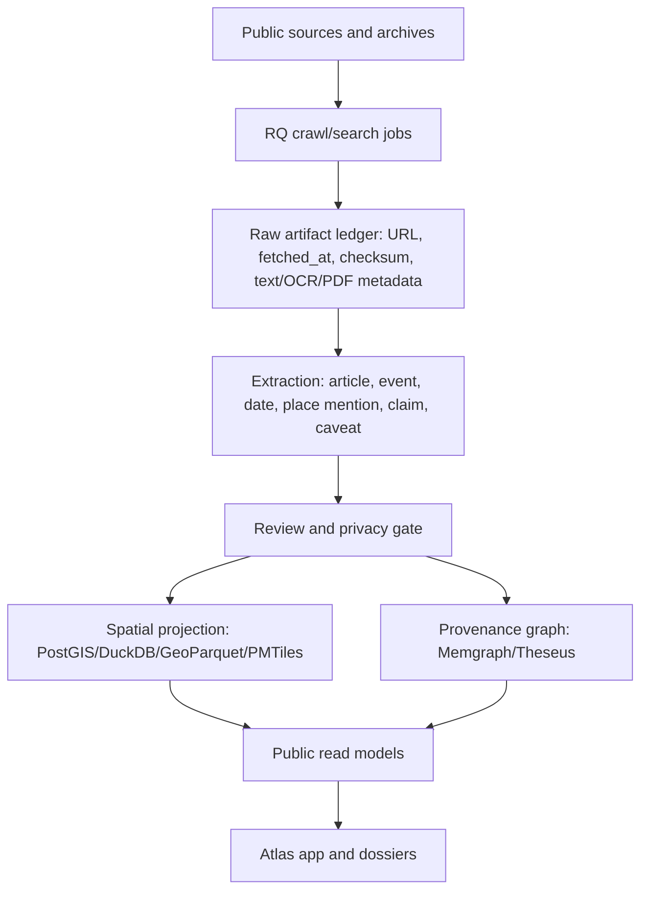

# Orchestrate Plan: Open Flint Atlas Round 2 Expansion

**Slug:** `open-flint-atlas-round-2`
**Mode:** `/orchestrate mode=plan`
**Source notes:** `Theseus/Civic Flint 3.md`, `docs/plans/open-flint-atlas/implementation-plan.md`
**Current package boundary:** `docs/plans/open-flint-atlas/public-package/`
**Planning date:** 2026-05-12

## Executive Summary

Round 1 made Open Flint Atlas real as a validated fixture boundary: source
registry, source probes, read model, provenance graph, contribution/privacy
workflow, static prototype, and public package docs.

Round 2 should expand the ambition without prematurely over-designing the
prototype. The next product shape is:

1. A present-day civic atlas.
2. A historical Flint memory map built from newspaper and archive sources.
3. A street-safety layer with crash trends first, forecasts later.
4. A source-aware ingestion system using RQ/crawl jobs, raw artifact storage,
   graph provenance, and PostGIS/DuckDB spatial projections.
5. A serious design program later, with Observable Framework, Plot, vgplot,
   Mosaic, cosmos.gl, React, Framer Motion, React Native, MapLibre, PMTiles,
   DuckDB-WASM, and design gates treated as first-class work.

## Current Condition

- OFA-001 through OFA-010 are validated in the first implementation plan.
- The static prototype is only a scaffold. It should not become the design
  center of gravity.
- Index-API already has adjacent runtime pieces: `CrawlJob`, RQ-backed crawl
  tasks, `run_search_crawl`, native search/Search Kernel, Memgraph graph
  runtime, Redis hot state, and spatial/spacetime/graph-training commands.
- The current source registry includes civic/GIS, property, MapFlint, crash,
  CDC PLACES, Census/TIGER, and Genesee County sources. It does not yet include
  historical newspaper archives.
- Competition-specific Gemma work, TimesFM, and spacetime GNN work should
  remain research layers until the atlas has reviewed historical series,
  road/corridor geometries, prediction labels, and current contest rules.

## Related Core One Planning

- Atlas Core One is the contract-and-manifest bridge between Round 1 fixtures and the later Round 2 runtime program: `docs/plans/open-flint-atlas/atlas-core-one-plan.md`.
- The source-manifest execution half for Atlas Core One is tracked in `docs/plans/open-flint-atlas/atlas-core-one-5-4-handoff.md`.
- The shared temporal grammar for Lost Flint, Civic Intervention Ledger, and Street Safety Lab is documented in `docs/plans/open-flint-atlas/spatial-event-index-contract.md`.

## Product Thesis

Open Flint Atlas can become a source-aware civic map and historical memory
engine for Flint.

The contest-worthy framing is not "AI predicts Flint." It is:

> Open Flint Atlas turns scattered public records, historical newspapers,
> safety data, and community observations into reviewable civic knowledge with
> visible sources, uncertainty, and place-based context.

## Competition Model Gate

Do not build the next Open Flint Atlas slices around a model-specific Gemma
assumption yet.

The competition target should be treated as **Gemma 4, fourth generation**, not
Gemma 3 or Gemma 3n. The previous planning pass cited stale general Gemma docs;
those citations are not acceptable for the contest path. Model integration
should happen near the end, after current competition rules and allowed Gemma 4
variants are pinned from an official competition source.

Before any model-specific implementation:

1. Verify the competition's current allowed model list.
2. Record the exact accepted Gemma 4 variant names.
3. Decide which tasks can be implemented with deterministic code first.
4. Add Gemma 4 only where it improves extraction, summarization, or review
   support without becoming the civic authority.

Good late-stage model jobs:

- Extract candidate civic events from articles, OCR, PDFs, meeting notes, and
  planning documents.
- Extract candidate place mentions from messy historical language.
- Produce resident-friendly dossier summaries from source-bounded text.
- Classify caveats such as `ocr_derived`, `place_ambiguous`,
  `historical_source`, `official_source`, or `needs_review`.
- Suggest which deterministic tool should run next: geocoder, source search,
  graph lookup, PostGIS join, or moderation queue.

Forbidden model jobs:

- Final truth adjudication.
- Final geocoding without review.
- Public identity extraction.
- Unlabeled predictions.
- Copyright-risky republication of newspaper text.

## Ingestion Architecture

Do not run "scrape -> graph -> PostGIS" as a strict sequence. Use one raw
artifact pipeline with two reviewed projections.

Raw artifacts preserve provenance. Extraction creates candidates. Review decides
what becomes public. PostGIS owns geometry. The graph owns sources, claims,
events, conflicts, dossiers, and review state.

## Four Crawl Workstreams

| Workstream | First sources | Primary output | Risk |
|---|---|---|---|
| Civic/GIS | City GIS, Genesee County GIS, MapFlint, planning docs | Present-day places, boundaries, zoning, public facilities | Terms/freshness drift |
| Community resources | Clinics, food access, shelters, libraries, neighborhood orgs | Resource layer and source cards | Stale service info |
| Historical memory | Black Community Newspapers of Flint, Flint Public Library/UM-Flint materials, Chronicling America | Historical article/event candidates and time map | OCR errors and copyright |
| Safety/mobility | Michigan Traffic Crash Facts, road segments, transportation plans | Crash aggregates, corridor trends, future risk research base | Overstated prediction |

Resident submissions become a fifth workstream only after storage, moderation,
retention, abuse handling, and reviewer permissions exist.

## Historical Newspaper Layer

The historical layer should become the soul of the product, but it must start
with careful rights and review constraints.

Target dossier fields:

| Field | Purpose |
|---|---|
| `article_id` | Stable source-linked article/page id. |
| `publication` | Newspaper or archive name. |
| `published_date` | Article date or issue date. |
| `title` | Article title or page heading when available. |
| `source_url` | Link to archive record, not a republished full article. |
| `ocr_excerpt` | Short, rights-conscious excerpt for review and search. |
| `event_summary` | Reviewer or model-assisted summary. |
| `candidate_places` | Place mentions extracted from text. |
| `resolved_place_id` | Reviewed place id when known. |
| `geometry_confidence` | Exact, approximate, neighborhood-only, or unresolved. |
| `entities` | Organizations, institutions, and public figures when source-safe. |
| `rights_note` | Reuse/copyright caveat. |
| `review_status` | Submitted, reviewed, accepted, conflict, or superseded. |

Initial slice: 50 to 100 historical article/event candidates from one archive
source, with no full article republication.

## Crash And Street Safety Layer

Start with descriptive and aggregate safety facts:

- Crash counts by year/month.
- Crash counts by corridor or road segment.
- Pedestrian and bicycle crash subsets where available.
- School, park, transit, commercial-corridor, and land-use context joins.
- Simple trend and uncertainty cards.

Avoid "this road will have a crash." Use language like:

> This corridor has elevated modeled risk based on historical crash patterns
> and nearby conditions. Forecast uncertainty is high.

## TimesFM And Spacetime GNN Placement

TimesFM belongs after reviewed time series exist. Use it for aggregate
forecasting, not individual event prediction:

- Monthly crash burden by corridor.
- Resource availability trend by ward.
- Historical event density by decade and neighborhood.
- Data freshness gaps by source and place.

Spacetime GNN belongs after the road graph and feature pipeline are mature:

- Road segments/intersections as graph elements.
- Historical crash labels.
- Road class, speed, land use, schools, parks, transit, and nearby services as
  features.
- Evaluation against a simple baseline.
- Uncertainty and fairness review before public display.

## Design And Renderer Program

The static prototype is a proving scaffold, not the future design target.
Design should become its own serious track.

| Technology | Likely role |
|---|---|
| Observable Framework | Public data story, civic essays, reproducible data app build. |
| Observable Plot | Fast readable charts for trends, distributions, and small multiples. |
| vgplot | DuckDB-backed exploratory views and fast grouped chart interactions. |
| Mosaic | Cross-filtering, linked charts, and table/map coordination. |
| cosmos.gl | Source/provenance/event graph views where graph topology matters. |
| React/Next | Durable app shell, dossier components, routes, auth/moderation later. |
| Framer Motion | Temporal transitions, layer changes, dossier reveal, time-map feel. |
| React Native | Later mobile/offline field workflow and resident-friendly capture. |
| MapLibre/PMTiles | Primary map renderer and cheap static spatial deployment. |
| DuckDB-WASM | Local analytical joins over public fixtures. |

Design gates for this track:

- Capture target references before building the next serious UI.
- Preserve the current static prototype as a baseline until a better surface
  exists.
- Separate runtime complete, product complete, and vision complete.
- Do not replace the primary route until the new UI is equal-or-better.
- Treat mobile as core, not a responsive afterthought.

## Checklist

| ID | Task | Grounding | Route | Acceptance criteria | Validation | Risk | Status |
|---|---|---|---|---|---|---|---|
| OFA2-001 | Add Round 2 source-expansion registry entries. | `source-registry.json`, `Civic Flint 3.md` | data/source | Historical newspapers, Chronicling America, Flint library/UM sources, and crash data expansion sources are represented with rights and freshness notes. | Source registry and probe validators. | Archive reuse/copyright mistakes. | planned |
| OFA2-002 | Define raw artifact ledger contract. | `CrawlJob`, S3/blob boundary, source probes | backend/data | Contract records URL, fetched date, checksum, content type, source id, rights note, and derived-text metadata. | Contract doc plus fixture validator. | Crawls become unreviewable blobs. | planned |
| OFA2-003 | Plan RQ crawl workstream adapter. | `apps/notebook/crawl_tasks.py`, `run_search_crawl` | backend/RQ | Four workstreams can enqueue bounded jobs with budgets, politeness, source ids, and audit receipts. | Django SimpleTestCase for job spec construction; no live crawl required. | Unbounded or impolite crawling. | planned |
| OFA2-004 | Define historical event extraction schema. | Competition model gate, archive layer | extraction/ML | Article/event candidate schema captures source, date, excerpt, candidate places, summary, caveats, rights, and review state without requiring a specific model yet. | JSON schema and moderation fixtures. | Model text becomes public fact. | planned |
| OFA2-005 | Define place-resolution workflow. | PostGIS/DuckDB split | spatial/review | Candidate places can be unresolved, approximate, neighborhood-only, or reviewed exact geometry. | Fixture with ambiguous historical place names. | False precision on the map. | planned |
| OFA2-006 | Add dual projection contract. | Memgraph/PostGIS architecture | graph/spatial | Same reviewed event can project to provenance graph and spatial read model without one being treated as canonical for the other. | Provenance graph fixture plus GeoJSON/GeoParquet fixture checks. | Graph or map becomes source of truth by accident. | planned |
| OFA2-007 | Build crash baseline plan before forecasting. | Michigan Traffic Crash Facts source | safety/data | Street-safety layer starts with aggregates, corridors, trend summaries, and caveat language. | Read-model fixture and public copy review. | Prediction theater. | planned |
| OFA2-008 | Scope TimesFM experiment. | TimesFM docs, crash/resource time series | ML/research | Experiment requires historical series sufficiency, baseline comparison, uncertainty bands, and prediction labels. | Experiment brief and not-run gate until data sufficiency passes. | Forecasts shown as facts. | planned |
| OFA2-009 | Scope spacetime GNN experiment. | Road graph and crash-risk research | ML/research | GNN is deferred until road graph, labels, features, baseline, and fairness checks exist. | Data sufficiency checklist. | Sparse crash labels create misleading risk maps. | planned |
| OFA2-010 | Create design technology brief. | User design direction | frontend/design | Observable, Plot, vgplot, Mosaic, cosmos.gl, React, Framer Motion, React Native, MapLibre, PMTiles, and DuckDB-WASM roles are separated. | Design brief review. | Prototype ossifies into the product. | planned |
| OFA2-011 | Plan first contest demo cut. | Product thesis | product | Demo path has present-day place dossier, historical memory dossier, and street-safety trend card. | Storyboard and data readiness checklist. | Demo is broad but shallow. | planned |
| OFA2-012 | Add release/governance implications. | Public package docs | product ops | Round 2 changes name governance, rights, moderation, and source freshness responsibilities. | Public package validator update. | Public infrastructure lacks stewardship. | planned |
| OFA2-013 | Add final Gemma 4 competition gate. | User correction and contest rules | ML/product | Plan records exact allowed Gemma 4 variants from official contest rules and keeps model integration out of earlier data-contract slices. | Official-rule citation and plan review before implementation. | Using an ineligible model generation. | planned |

## Recommended Next Implementation Slice

Start with OFA2-001 through OFA2-005 only:

1. Add historical archive and crash expansion sources to the registry.
2. Add source probes for those sources.
3. Define raw artifact and historical event candidate schemas.
4. Add fixture examples for 3 to 5 historical article/event candidates.
5. Add a place-resolution fixture with at least one ambiguous historical place.

Do not start with Gemma 4 integration, TimesFM, the GNN, or a full app
redesign. Those become much better once the source and event contracts are real.

## Source References

- [TimesFM GitHub repository](https://github.com/google-research/timesfm/)
- [RQ documentation](https://python-rq.org/docs/)
- [Scrapy documentation](https://docs.scrapy.org/en/latest/index.html)
- [Black Community Newspapers of Flint](https://quod.lib.umich.edu/b/blackcommunitynews/)
- [Chronicling America API](https://chroniclingamerica.loc.gov/about/api/)
- [Michigan Traffic Crash Facts](https://www.michigantrafficcrashfacts.org/)
- [DeepMind traffic prediction with GNNs](https://deepmind.google/blog/traffic-prediction-with-advanced-graph-neural-networks)
